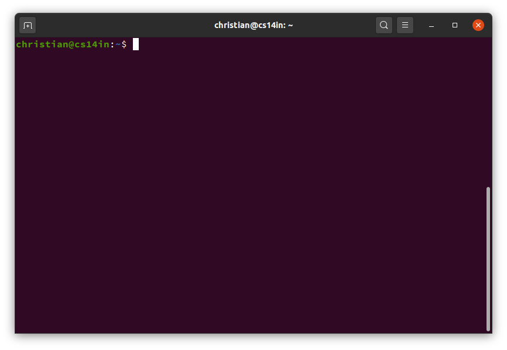

# Jobbe i shell (bash)

Start `Terminal` så får du opp et vindu som vist her:

Terminalen brukes til å kommunisere med shellet. Shellet er et grensesnitt for å kjøre kommandoer fra tastaturet (Standard input) eller en fil. Den kan i tillegg lagre variabler som kan brukes til å endre oppførselen til både shellet og andre programmer.

Her kommer vi til å fokusere på _bash_ som er blant de vanligste shellene.

## Lage en variabel i bash

    > MyVar=Test

## Se verdien til en variabel i bash

    > echo $MyVar

## Slette en variabel i bash

    > unset MyVar`

Hver gang vi kjører en kommando blir kommandoen kjørt i kontekst av en ny shell. Dette vises lettest ved å kjøre `bash` etter å ha laget en variabel og prøve å se verdien. For å gå ut av den nye bash instansen, skriver vi `exit` eller trykker `CTRL-D`.

For å få verdien til å bli med til det nye shellet, skriver vi:

    > export MyVar=Test

Når vi starter en ny terminal (eller kjører `bash`) leses inn en fil som heter `.bashrc`. Denne filen kan brukes til å sette opp shellet som vi vil automatisk. Se `.bashrc` ved å skrive:

    > less ~/.bashrc

En annen ting vi kan gjøre er å definere aliaser. Dette kommer vil til senere, men det er en fordel å definere aliaser i `.bashrc` så de er tilgjgenglige hele tiden.

(Hvorfor vi skriver `~/` kommer vi tilbake til senere.)

# Andre shell

Bash er ikke det eneste shellet. Det er en "nyere" versjon av noe som heter Bourne Shell, og navnet er et slags akronym for "Bourne Again Shell".

Andre shell du kan møte på:
- tcsh
- zsh

Merk at andre shell har forskjellig syntaks og filnavn (`.bashrc`) enn bash.

# Nyttige ressurser
- `> man bash`
- [What happens when you execute a command in the shell?](https://medium.com/@SergioPietri/behind-the-scenes-what-happens-when-you-execute-a-command-in-the-shell-9fef53832f6a)